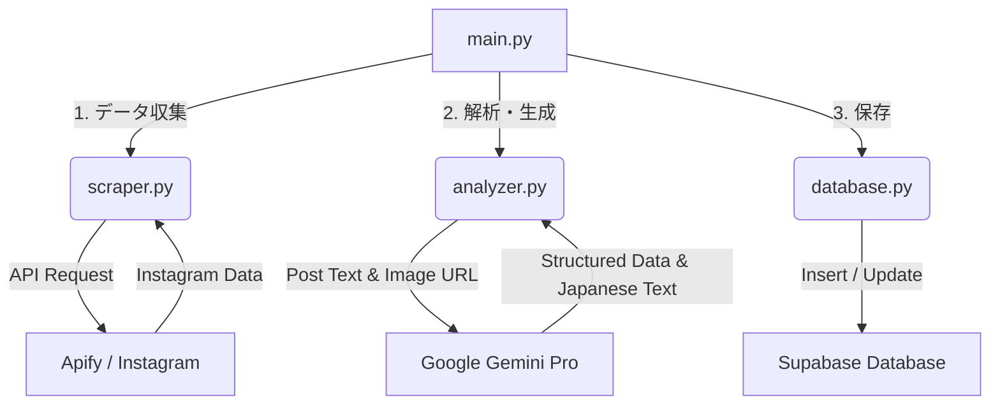

# Toronto Info - システムアーキテクチャ

このプロジェクトは、Instagramから特定の情報を収集・分析し、データベースへ蓄積する自動化システムです。

## 1. 全体フロー

システムの中核となる `main.py` が司令塔となり、データ収集、解析、保存の一連の流れを統括しています。

## 2. 各システム・APIの役割

### ① Apify (Instagram Scraper)
*   **担当ファイル**: `scraper.py`
*   **役割**: 人間の代わりにInstagramを閲覧し、データを収集する「手足」の役割。
*   **仕組み**: 
    *   PythonからApify APIを叩き、クラウド上でスクレイピングを実行させます。
    *   指定したURL（ハッシュタグやアカウント）を巡回し、投稿データをJSON形式で返却します。
    *   **ポイント**: Instagramの強力なブロック機能を回避し、安定してデータを取得するために利用しています。

### ② Google Gemini 1.5 Pro
*   **担当ファイル**: `analyzer.py`
*   **役割**: 収集したデータの内容を理解し、整理・翻訳する「頭脳」の役割。
*   **仕組み**:
    *   投稿の「本文」と「画像」をAIに渡します。
    *   AIが内容を読み取り、「求人」「家」「イベント」「その他」に**自動分類**します。
    *   元の文章をもとに、サイト掲載用の**自然な日本語紹介文**を作成します。

### ③ Supabase
*   **担当ファイル**: `database.py`
*   **役割**: 作成されたデータを蓄積・管理する「保管庫」の役割。
*   **仕組み**:
    *   解析済みのデータを `posts` テーブルに保存します。
    *   **重複チェック**: Instagramの投稿ID (`shortcode`) をキーにして、既に存在するデータは上書き、新しいデータは追加という判断を自動で行います。

## 3. ファイル構成と連携

| ファイル名 | 役割 | 連携先 |
| :--- | :--- | :--- |
| **`main.py`** | **実行スクリプト**。 全体の処理順序を制御し、各モジュールを呼び出す。 | 全ファイル |
| **`scraper.py`** | **収集モジュール**。 Apify APIを呼び出し、不要なデータ（古い投稿など）をフィルタリングして返す。 | Apify API |
| **`analyzer.py`** | **解析モジュール**。 Gemini APIを呼び出し、非構造化データ（テキスト）を構造化データ（JSON）に変換する。 | Google Gemini API |
| **`database.py`** | **保存モジュール**。 Supabaseクライアントを操作し、データの整合性を保ちながら保存する。 | Supabase |
| **`.env`** | **設定ファイル**。 各APIキー（Apify, Gemini, Supabase）を安全に管理する。 | なし (各モジュールが読み込み) |
